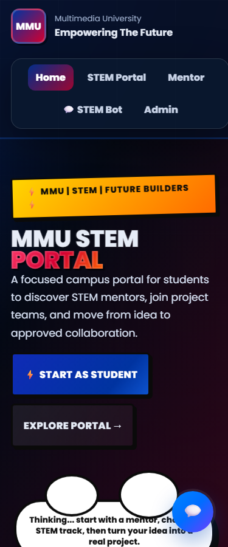
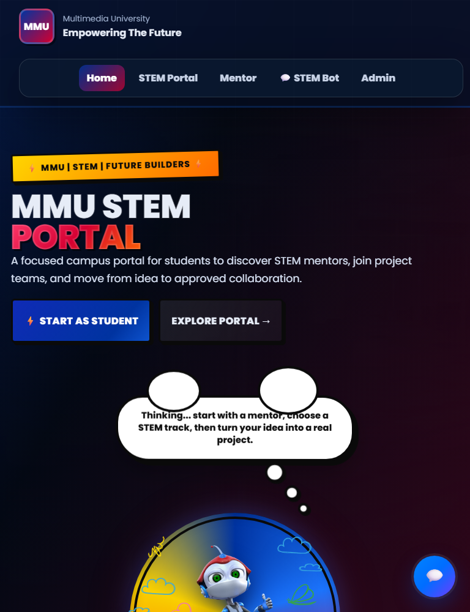
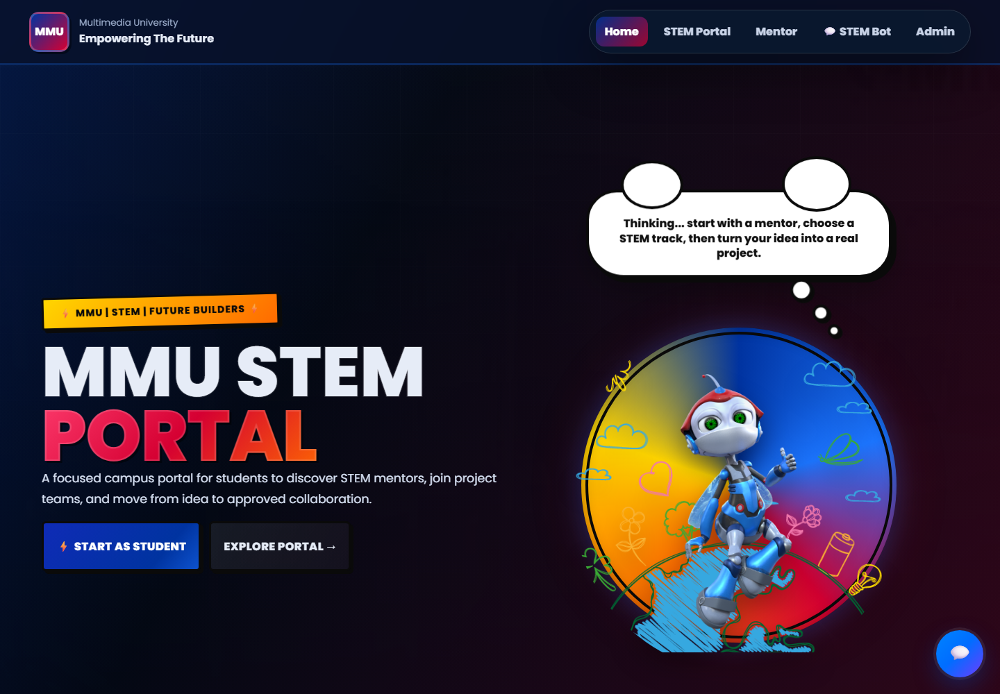

# MMU STEM Mentorship and Collaboration Portal

An Angular web portal for Multimedia University students, mentors, and administrators to explore STEM mentors, collaborate on projects, manage requests, and use the built-in STEM Bot.

The repository contains an Angular frontend and a Flask authentication API backed by SQLite. The injectable `DemoBackend` service still supplies the existing mentor, project, request, and chatbot portfolio data; those catalog/workspace changes reset on a full reload.

## How the application works

- **Home** introduces the portal and links to the student experience.
- **STEM Portal** lets students browse mentors and projects and manage mentorship or project requests.
- **Mentor Portal** provides the existing mentor sign-in/registration forms, request decisions, and project creation.
- **Admin Portal** exposes the demo student and mentor approval lists.
- **STEM Bot** answers questions using the local demo response logic and can be moved around the viewport.
- Student, mentor, and admin authentication is verified by Flask against hashed passwords stored in SQLite.

No branding, visible copy, page layout, styling, asset, or user journey was intentionally redesigned during the Angular 22 update.

## Technology stack

- Angular 22.1 (standalone application)
- Angular Router
- Angular HttpClient provider
- TypeScript 6.0
- HTML5
- Plain CSS3
- RxJS 7.8
- Flask 3.1
- SQLite
- Vitest with Happy DOM
- Node.js 22
- npm 10

No Angular Material, Bootstrap, Tailwind CSS, or other UI framework is used.

## Frontend architecture

The application boots from `src/main.ts` with the providers in `src/app/app.config.ts`. Angular Router owns the public URLs in `src/app/app.routes.ts`. Typed `AuthenticationService` requests are sent through Angular HttpClient to Flask. Passwords are hashed before SQLite storage. `DemoBackend` retains the existing non-authentication demo behavior.

The detailed pre-migration inventory, route mapping, data dependencies, and preserved workflows are in [docs/MIGRATION_MAP.md](docs/MIGRATION_MAP.md).

```text
src/
├── app/
│   ├── app.ts
│   ├── app.html
│   ├── app.css
│   ├── app.config.ts
│   ├── app.routes.ts
│   ├── core/
│   │   └── api/
│   │       └── demo-backend.service.ts
│   └── route-stub.{ts,html,css}
├── assets/
├── environments/
│   ├── environment.ts
│   └── environment.production.ts
├── index.html
├── main.ts
└── styles.css
backend/
├── app.py
├── requirements.txt
└── test_app.py
api/
└── index.py
```

## Prerequisites

Install:

- Node.js 22.22.3 or newer, or Node.js 24.15.0 or newer
- npm 10.x
- Python 3.10 or newer

Confirm the installed versions:

```powershell
node --version
npm --version
```

## Install

From the directory containing `package.json`:

```powershell
npm install
```

## Run for development

Install the Flask dependencies once:

```powershell
npm run backend:install
```

Start Flask in the first terminal:

```powershell
npm run backend:start
```

The API runs at `http://127.0.0.1:5000/api`.

Open a second terminal in the same project directory and start Angular:

```powershell
npm start
```

Open `http://localhost:4200/`. The Angular development server reloads the page when source files change.

To bind the server to another interface:

```powershell
npm start -- --host 0.0.0.0
```

## Production build

```powershell
npm run build
```

The browser bundle is written to `dist/frontend/browser/`.

To preview that production output locally, use any static server that falls back unknown routes to `index.html`.

## Tests

Run the complete test suite once:

```powershell
npm test -- --watch=false
```

Run in watch mode:

```powershell
npm test
```

Run the Flask authentication tests:

```powershell
npm run backend:test
```

The tests cover authentication requests, form validation, SQLite login/registration, demo business rules, and the public route map.

## Demo login credentials

| Actor | Login ID | Email | Password/access code |
| --- | --- | --- | --- |
| Student | `STU001` | `demo.student@mmu.edu.my` | `student123` |
| Mentor | `MEN001` | `aisha.rahman@mmu.edu.my` | `mentor123` |
| Admin | `ADM001` | `admin@mmu.edu.my` | `admin123` |

The student and mentor forms accept the displayed email and password/access code. The admin form accepts `ADM001` and `admin123`. New students and mentors can use the existing registration forms; the API assigns an actor ID after registration.

## Backend connection and environment configuration

Angular `HttpClient` is registered in `app.config.ts`. The API base URL is configured in:

- `src/environments/environment.ts` for development
- `src/environments/environment.production.ts` for production

Development uses `http://127.0.0.1:5000/api`. Production uses the same-origin `/api` Vercel Python function. Local SQLite data is created automatically at `backend/instance/portal.db`; the database file is ignored by Git.

## Application routes

| Route | Purpose |
| --- | --- |
| `/home` | Landing page |
| `/stem-portal` | Mentors, projects, and student workspace |
| `/student-portal` | Legacy redirect to `/stem-portal` |
| `/mentor-portal` | Mentor access and workspace |
| `/chatbot` | Chatbot route entry; the bot is also globally available |
| `/admin-portal` | Demo administration dashboard |
| Any unknown route | Redirects to `/home` |

Vercel uses `vercel.json` to return `index.html` for client-side routes, which preserves direct refresh behavior.

## Interface screenshots

Reference screenshots are stored in `docs/screenshots/` at widths of 375 px, 768 px, and 1440 px for Home, STEM Portal, Mentor Portal, and Admin Portal.

| 375 px | 768 px | 1440 px |
| --- | --- | --- |
|  |  |  |

The remaining route screenshots use the names `stem-portal-{width}.png`, `mentor-portal-{width}.png`, and `admin-portal-{width}.png` in the same directory.

## Assets and styling

Static files are served from `public/`, including the original MMU mascot and workspace imagery. The application uses the original Poppins font reference and the existing component stylesheet. Media queries, hover behavior, animations, colors, spacing, borders, and shadows were retained.

## Deployment

For Vercel, import this directory as the project root. `vercel.json` runs the production build, publishes `dist/frontend/browser`, and rewrites SPA routes to `index.html`.

## Current limitations

- Authentication accounts persist locally in SQLite.
- Mentor/project/request catalog mutations remain in-memory demo data and reset on reload.
- SQLite storage in a serverless Vercel function is temporary; use a managed persistent database for production accounts.
- The checked-in application began as a single large preserved UI shell; further feature-component extraction should be paired with visual regression tooling to avoid changing the legacy stylesheet’s selector behavior.
